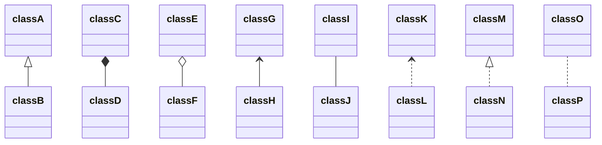
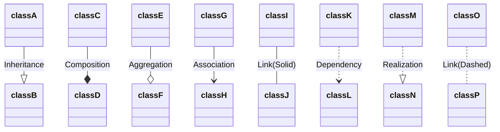
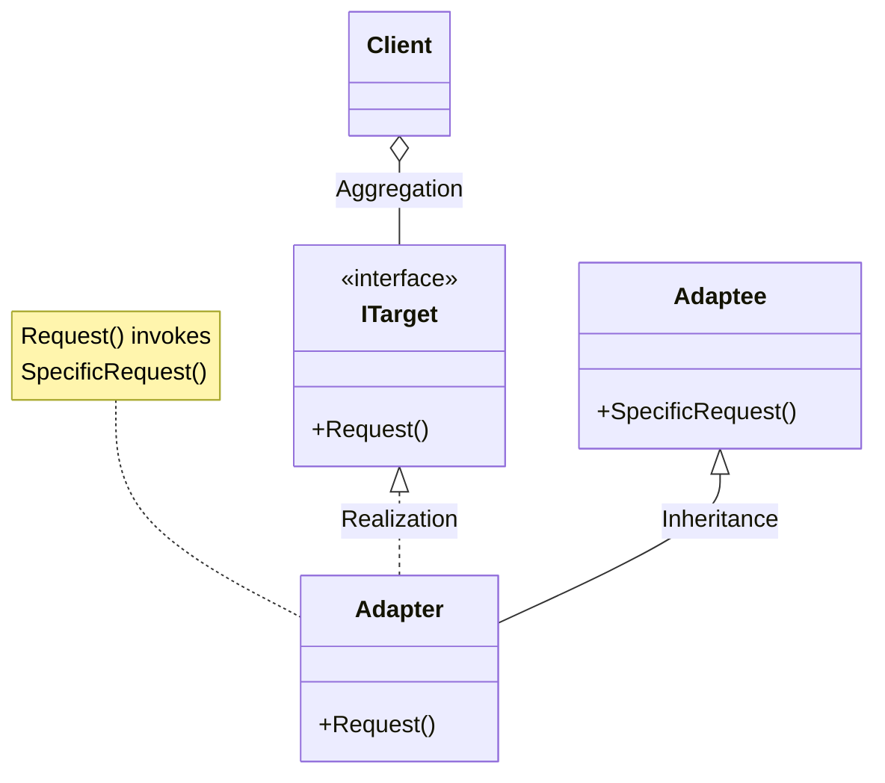
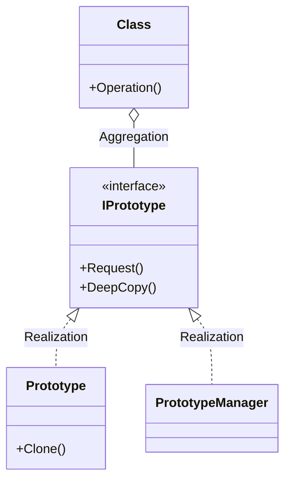

<p align="center">
  
    
</p>


# Rust_Design_Patterns_Training
Rust is not object-oriented, and the combination of all its characteristics, such as functional elements, a strong type system, and the borrow checker, makes it unique. Because of this, Rust design patterns vary with respect to other traditional object-oriented programming languages. 


# Design-Patterns (Rustlang)<a href="https://www.rust-lang.org/"></a>

https://rust-unofficial.github.io/patterns/intro.html

https://github.com/rust-unofficial/patterns

<br>

<hr>

# 이건 러스트 디자인 패턴 다른 자료 ebook

https://refactoring.guru/design-patterns/rust

# 오리지날 디자인 패턴 책(1994년에 만들어진 책 - 바이블 ^^)
- Design Patterns: Elements of Reusable Object-Oriented Software 1st Edition, Kindle Edition
  - by Gamma Erich (Author), Helm Richard (Author), Johnson Ralph (Author), Vlissides John (Author), & 1 more Format: Kindle Edition
    - [Design Pattern] GoF(Gang of Four) 디자인 패턴  그 유명한 GoF라 불리운다.
  - https://www.amazon.com/Design-Patterns-Object-Oriented-Addison-Wesley-Professional-ebook/dp/B000SEIBB8

- 한국분이 자바로 정리함.
  - https://realzero0.github.io/study/2017/06/12/%EB%94%94%EC%9E%90%EC%9D%B8-%ED%8C%A8%ED%84%B4-%EC%A0%95%EB%A6%AC.html
- GoF(Gang of Four)에서는 23가지 디자인 패턴을 3가지 유형으로 분류합니다.

<hr>

<br>

# GoF(Gang of Four)에서 23가지 디자인 패턴을 3가지 유형으로 분류

https://realzero0.github.io/study/2017/06/12/%EB%94%94%EC%9E%90%EC%9D%B8-%ED%8C%A8%ED%84%B4-%EC%A0%95%EB%A6%AC.html
 
<table border="1">
    <tr>
    <td colspan="5" align="center">Design Patterns<br>By Purpose</td>
    </tr>
    <tr align="center">
        <td colspan="2"></td>
        <td>Creational</td>
        <td>Structural</td>
        <td>Behavioral</td>
    </tr>
    <tr align="center">
        <td rowspan="2">By Scope</td>
        <td>Class</td>
        <td align="left"><li>Factoriy<br>Method</li></td>
        <td align="left"><li>Adapter</li>(class)</td>
        <td align="left"><li>Interpreter</li><li>Template<br>Method</li></td>
    </tr>
    <tr align="center">
        <td>Object</td>
        <td align="left"><li>Abstract Factory</li><li>Builder</li><li>Prototype</li><li>Singleton</li></td>
        <td align="left"><li>Adapter</li>(object)<li>Bridge</li><li>Composite</li><li>Decorator</li><li>Facade</li><li>Flyweight</li><li>Proxy</li></td>
        <td align="left"><li>Chain of Responsibility</li><li>Command</li><li>Iterator</li><li>Mediator</li><li>Memento</li><li>Observer</li><li>State</li><li>Strategy</li><li>Visitor</li></td>
    </tr>
</table>


<table border="1">
<thead><tr><th>Type</th><th>Description</th></tr></thead><tbody><tr><td><code>&lt;|--</code></td><td>Inheritance</td></tr><tr><td><code>*--</code></td><td>Composition</td></tr><tr><td><code>o--</code></td><td>Aggregation</td></tr><tr><td><code>--&gt;</code></td><td>Association</td></tr><tr><td><code>--</code></td><td>Link (Solid)</td></tr><tr><td><code>..&gt;</code></td><td>Dependency</td></tr><tr><td><code>..|&gt;</code></td><td>Realization</td></tr><tr><td><code>..</code></td><td>Link (Dashed)</td></tr></tbody>
</table>

<code>
<span class="line"><span style="color:#F97583;">classDiagram</span></span>
<span class="line"><span style="color:#B392F0;">classA</span><span style="color:#E1E4E8;"> </span><span style="color:#F97583;">&lt;|--</span><span style="color:#E1E4E8;"> </span><span style="color:#B392F0;">classB</span></span>
<span class="line"><span style="color:#B392F0;">classC</span><span style="color:#E1E4E8;"> </span><span style="color:#F97583;">*--</span><span style="color:#E1E4E8;"> </span><span style="color:#B392F0;">classD</span></span>
<span class="line"><span style="color:#B392F0;">classE</span><span style="color:#E1E4E8;"> </span><span style="color:#F97583;">o--</span><span style="color:#E1E4E8;"> </span><span style="color:#B392F0;">classF</span></span>
<span class="line"><span style="color:#B392F0;">classG</span><span style="color:#E1E4E8;"> </span><span style="color:#F97583;">&lt;--</span><span style="color:#E1E4E8;"> </span><span style="color:#B392F0;">classH</span></span>
<span class="line"><span style="color:#B392F0;">classI</span><span style="color:#E1E4E8;"> </span><span style="color:#F97583;">--</span><span style="color:#E1E4E8;"> </span><span style="color:#B392F0;">classJ</span></span>
<span class="line"><span style="color:#B392F0;">classK</span><span style="color:#E1E4E8;"> </span><span style="color:#F97583;">&lt;..</span><span style="color:#E1E4E8;"> </span><span style="color:#B392F0;">classL</span></span>
<span class="line"><span style="color:#B392F0;">classM</span><span style="color:#E1E4E8;"> </span><span style="color:#F97583;">&lt;|..</span><span style="color:#E1E4E8;"> </span><span style="color:#B392F0;">classN</span></span>
<span class="line"><span style="color:#B392F0;">classO</span><span style="color:#E1E4E8;"> </span><span style="color:#F97583;">..</span><span style="color:#E1E4E8;"> </span><span style="color:#B392F0;">classP</span></span>
</code>




- 그림으로 보면서 암기하기 

<code>
<span class="line"><span style="color:#F97583;">classDiagram</span></span>
<span class="line"><span style="color:#B392F0;">classA</span><span style="color:#E1E4E8;"> </span><span style="color:#F97583;">--|&gt;</span><span style="color:#E1E4E8;"> </span><span style="color:#B392F0;">classB</span><span style="color:#E1E4E8;"> </span><span style="color:#F97583;">:</span><span style="color:#E1E4E8;"> </span><span style="color:#9ECBFF;">Inheritance</span></span>
<span class="line"><span style="color:#B392F0;">classC</span><span style="color:#E1E4E8;"> </span><span style="color:#F97583;">--*</span><span style="color:#E1E4E8;"> </span><span style="color:#B392F0;">classD</span><span style="color:#E1E4E8;"> </span><span style="color:#F97583;">:</span><span style="color:#E1E4E8;"> </span><span style="color:#9ECBFF;">Composition</span></span>
<span class="line"><span style="color:#B392F0;">classE</span><span style="color:#E1E4E8;"> </span><span style="color:#F97583;">--o</span><span style="color:#E1E4E8;"> </span><span style="color:#B392F0;">classF</span><span style="color:#E1E4E8;"> </span><span style="color:#F97583;">:</span><span style="color:#E1E4E8;"> </span><span style="color:#9ECBFF;">Aggregation</span></span>
<span class="line"><span style="color:#B392F0;">classG</span><span style="color:#E1E4E8;"> </span><span style="color:#F97583;">--&gt;</span><span style="color:#E1E4E8;"> </span><span style="color:#B392F0;">classH</span><span style="color:#E1E4E8;"> </span><span style="color:#F97583;">:</span><span style="color:#E1E4E8;"> </span><span style="color:#9ECBFF;">Association</span></span>
<span class="line"><span style="color:#B392F0;">classI</span><span style="color:#E1E4E8;"> </span><span style="color:#F97583;">--</span><span style="color:#E1E4E8;"> </span><span style="color:#B392F0;">classJ</span><span style="color:#E1E4E8;"> </span><span style="color:#F97583;">:</span><span style="color:#E1E4E8;"> </span><span style="color:#9ECBFF;">Link(Solid)</span></span>
<span class="line"><span style="color:#B392F0;">classK</span><span style="color:#E1E4E8;"> </span><span style="color:#F97583;">..&gt;</span><span style="color:#E1E4E8;"> </span><span style="color:#B392F0;">classL</span><span style="color:#E1E4E8;"> </span><span style="color:#F97583;">:</span><span style="color:#E1E4E8;"> </span><span style="color:#9ECBFF;">Dependency</span></span>
<span class="line"><span style="color:#B392F0;">classM</span><span style="color:#E1E4E8;"> </span><span style="color:#F97583;">..|&gt;</span><span style="color:#E1E4E8;"> </span><span style="color:#B392F0;">classN</span><span style="color:#E1E4E8;"> </span><span style="color:#F97583;">:</span><span style="color:#E1E4E8;"> </span><span style="color:#9ECBFF;">Realization</span></span>
<span class="line"><span style="color:#B392F0;">classO</span><span style="color:#E1E4E8;"> </span><span style="color:#F97583;">..</span><span style="color:#E1E4E8;"> </span><span style="color:#B392F0;">classP</span><span style="color:#E1E4E8;"> </span><span style="color:#F97583;">:</span><span style="color:#E1E4E8;"> </span><span style="color:#9ECBFF;">Link(Dashed)</span></span>
</code>



# Adapter Pattern(어탭터 패턴)



- code

```
classDiagram
Client o-- ITarget : Aggregation
ITarget <|.. Adapter : Realization
Adaptee <|-- Adapter : Inheritance

class ITarget
<<interface>> ITarget
ITarget : +Request()

class Adaptee
Adaptee : +SpecificRequest()


note for Adapter "Request() invokes<br>SpecificRequest()"
class Adapter
Adapter : +Request()

```

# Prototype Pattern(프로토 타입 패턴)



- code

```
classDiagram
Class o-- IPrototype : Aggregation
IPrototype <|.. Prototype : Realization
IPrototype <|.. PrototypeManager : Realization

Class Class
Class : +Operation()

class IPrototype
<<interface>> IPrototype
IPrototype : +Request()
IPrototype : +DeepCopy()

class PrototypeManager


class Prototype
Prototype : +Clone()
  
  
```

<br>

<hr>


출처 : https://mermaid.js.org/syntax/classDiagram.html

# 다이어그램으로 코드 이해(mermaid)


<hr>


# Design principles

https://rust-unofficial.github.io/patterns/additional_resources/design-principles.html


# Design Patterns __ 8 Design Patterns EVERY Developer Should Know(python 코드로 쉽게 설명해줌)

https://youtu.be/tAuRQs_d9F8


## A brief overview over common design principles

# SOLID
  - Single Responsibility Principle (SRP): A class should only have a single responsibility, that is, only changes to one part of the software's specification should be able to affect the specification of the class.
  
  - Open/Closed Principle (OCP): "Software entities ... should be open for extension, but closed for modification."

  - Liskov Substitution Principle (LSP): "Objects in a program should be replaceable with instances of their subtypes without altering the correctness of that program."

  - Interface Segregation Principle (ISP): "Many client-specific interfaces are better than one general-purpose interface."

  - Dependency Inversion Principle (DIP): One should "depend upon abstractions, [not] concretions."
DRY (Don’t Repeat Yourself)

"Every piece of knowledge must have a single, unambiguous, authoritative representation within a system"

# KISS principle

most systems work best if they are kept simple rather than made complicated; therefore, simplicity should be a key goal in design, and unnecessary complexity should be avoided

# Law of Demeter (LoD)

a given object should assume as little as possible about the structure or properties of anything else (including its subcomponents), in accordance with the principle of "information hiding"

# Design by contract (DbC)

software designers should define formal, precise and verifiable interface specifications for software components, which extend the ordinary definition of abstract data types with preconditions, postconditions and invariants

# Encapsulation

bundling of data with the methods that operate on that data, or the restricting of direct access to some of an object's components. Encapsulation is used to hide the values or state of a structured data object inside a class, preventing unauthorized parties' direct access to them.

# Command-Query-Separation(CQS)

“Functions should not produce abstract side effects...only commands (procedures) will be permitted to produce side effects.” - Bertrand Meyer: Object-Oriented Software Construction

# Principle of least astonishment (POLA)
a component of a system should behave in a way that most users will expect it to behave. The behavior should not astonish or surprise users

# Linguistic-Modular-Units
“Modules must correspond to syntactic units in the language used.” - Bertrand Meyer: Object-Oriented Software Construction

# Self-Documentation
“The designer of a module should strive to make all information about the module part of the module itself.” - Bertrand Meyer: Object-Oriented Software Construction

# Uniform-Access
“All services offered by a module should be available through a uniform notation, which does not betray whether they are implemented through storage or through computation.” - Bertrand Meyer: Object-Oriented Software Construction

# Single-Choice

“Whenever a software system must support a set of alternatives, one and only one module in the system should know their exhaustive list.” - Bertrand Meyer: Object-Oriented Software Construction

# Persistence-Closure
“Whenever a storage mechanism stores an object, it must store with it the dependents of that object. Whenever a retrieval mechanism retrieves a previously stored object, it must also retrieve any dependent of that object that has not yet been retrieved.” - Bertrand Meyer: Object-Oriented Software Construction

<br>

<hr>


